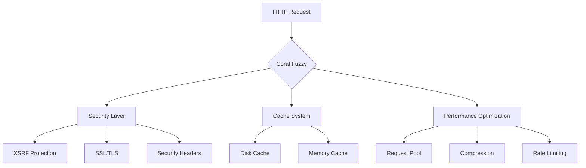
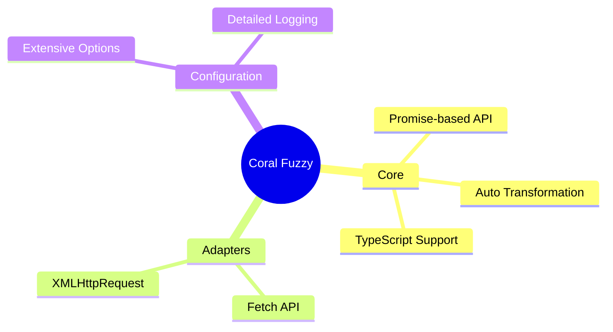
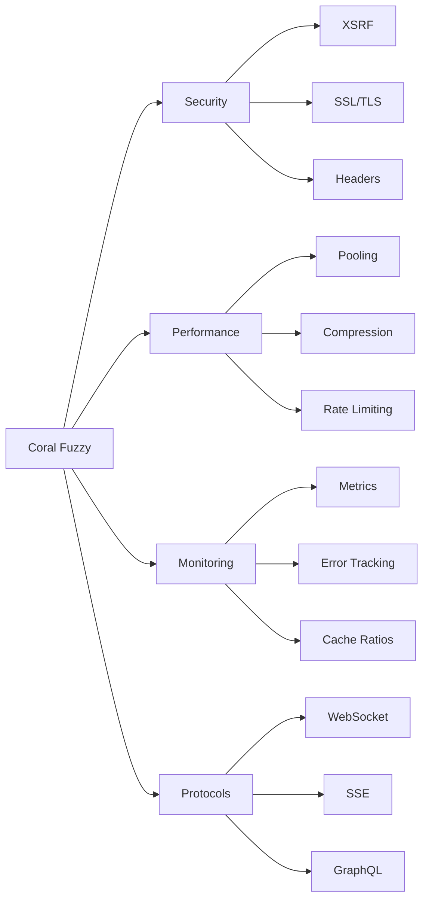
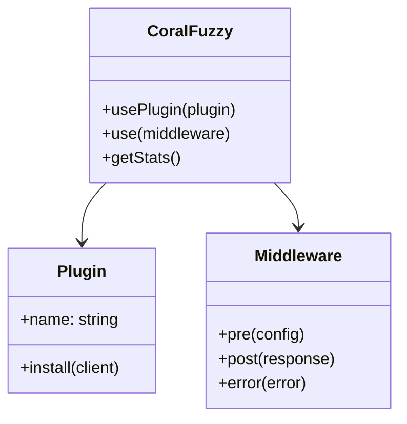

# Coral Fuzzy

<div align="center">

[](https://opensource.org/licenses/MIT)
[](https://www.typescriptlang.org/)

**Modern, Powerful and Intelligent HTTP Client**

[Quick Start](#quick-start) •
[Features](#features) •
[Installation](#installation) •
[Documentation](#documentation) •
[Examples](#examples) •
[Contributing](#contributing)

</div>

## 🎯 Why Coral Fuzzy?

Coral Fuzzy is a powerful and flexible HTTP client designed to meet the complex HTTP needs of modern web applications. Written in TypeScript, it offers advanced features and a comprehensive plugin system.



## ✨ Features

### 🚀 Core Features (v0.1.0)



### 🔥 Advanced Features (v0.2.0-v0.3.0)



## 🚀 Quick Start

### 📦 Installation

```bash
npm install coral-fuzzy
```

### 🎮 Basic Usage

```typescript
import { CoralFuzzy } from 'coral-fuzzy';

// Create client
const client = new CoralFuzzy({
  baseURL: 'https://api.example.com',
  timeout: 5000
});

// GET request
const users = await client.get('/users');

// POST request with JSON
const newUser = await client.post('/users', {
  data: {
    name: 'John Doe',
    email: 'john@example.com'
  }
});

// GET request with query parameters
const filteredUsers = await client.get('/users', {
  params: {
    role: 'admin',
    active: true
  }
});

// PUT request with headers
const updatedUser = await client.put('/users/123', {
  data: { status: 'active' },
  headers: {
    'X-Custom-Header': 'value'
  }
});
```

### 🛡️ Advanced Security Configuration

```typescript
const client = new CoralFuzzy({
  security: {
    xsrf: {
      enabled: true,
      cookieName: 'XSRF-TOKEN',
      headerName: 'X-XSRF-TOKEN'
    },
    ssl: {
      verify: true,
      cert: fs.readFileSync('cert.pem'),
      key: fs.readFileSync('key.pem')
    },
    headers: {
      'Strict-Transport-Security': 'max-age=31536000',
      'X-Content-Type-Options': 'nosniff',
      'X-Frame-Options': 'DENY',
      'X-XSS-Protection': '1; mode=block'
    },
    validateRequest: (config) => {
      // Custom validation logic
      if (config.url.includes('sensitive')) {
        throw new Error('Access denied to sensitive endpoint');
      }
      return config;
    }
  }
});
```

### ⚡ Performance Optimization

```typescript
const client = new CoralFuzzy({
  performance: {
    pool: {
      maxConcurrent: 10,
      requestsPerSecond: 50,
      queueTimeout: 30000
    },
    compression: {
      enabled: true,
      threshold: 1024,
      algorithms: ['gzip', 'deflate', 'br']
    },
    cache: {
      storage: 'memory',
      maxAge: 5 * 60 * 1000,
      maxSize: 100,
      exclude: ['/auth', '/live-data'],
      validateCache: (response) => {
        return response.headers.get('cache-control') !== 'no-store';
      }
    },
    circuitBreaker: {
      enabled: true,
      failureThreshold: 5,
      resetTimeout: 30000
    }
  }
});
```

### 📊 Metrics Monitoring

```typescript
// Get metrics
const stats = client.getStats();

// Performance metrics
console.log('Request metrics:', {
  total: stats.performance.totalRequests,
  successful: Math.floor(stats.performance.totalRequests * stats.performance.successRate),
  failed: Math.floor(stats.performance.totalRequests * stats.performance.errorRate),
  averageTime: stats.performance.averageResponseTime
});

// Cache metrics
console.log('Cache metrics:', {
  hits: stats.performance.cacheStats.hits,
  misses: stats.performance.cacheStats.misses,
  ratio: stats.performance.cacheStats.ratio
});

// Compression metrics
console.log('Compression savings:', {
  originalSize: stats.performance.compressionStats.totalOriginalSize,
  compressedSize: stats.performance.compressionStats.totalCompressedSize,
  saved: stats.performance.compressionStats.totalOriginalSize - stats.performance.compressionStats.totalCompressedSize,
  ratio: stats.performance.compressionStats.averageRatio
});

// Error tracking
console.log('Error statistics:', {
  total: stats.performance.errorStats.total,
  byType: stats.performance.errorStats.types
});
```

## 📈 Performance Comparison

```mermaid
gantt
    title HTTP Clients Performance Comparison
    dateFormat X
    axisFormat %s
    
    section Coral Fuzzy
    Request Processing    :0, 3
    Cache Hit            :0, 1
    
    section Axios
    Request Processing   :0, 4
    Cache Hit           :0, 2
    
    section Fetch API
    Request Processing  :0, 5
    Cache Hit          :0, 3
```



## 🔌 Plugin System



### 📝 Plugin Example

```typescript
// Advanced logger plugin with timing and error tracking
await client.usePlugin({
  name: 'advanced-logger',
  install: (client) => {
    client.use({
      pre: async (config) => {
        // Start timing
        config.metadata = {
          startTime: performance.now(),
          requestId: Math.random().toString(36).substring(7)
        };
        console.log(`[${config.metadata.requestId}] Request: ${config.method} ${config.url}`);
        return config;
      },
      post: async (response) => {
        // Calculate duration
        const duration = performance.now() - response.config.metadata.startTime;
        console.log(`[${response.config.metadata.requestId}] Response: ${response.status} (${duration.toFixed(2)}ms)`);
        
        // Log response size if available
        const size = response.headers.get('content-length');
        if (size) {
          console.log(`[${response.config.metadata.requestId}] Size: ${(parseInt(size) / 1024).toFixed(2)}KB`);
        }
        
        return response;
      },
      error: async (error) => {
        // Enhanced error logging
        console.error(`[${error.config.metadata.requestId}] Error: ${error.message}`, {
          status: error.response?.status,
          data: error.response?.data,
          config: {
            url: error.config.url,
            method: error.config.method,
            headers: error.config.headers
          }
        });
        throw error;
      }
    });
  }
});
```

## 📚 Detailed Documentation

- [🚀 Getting Started](docs/getting-started.md)
- [📖 Basic Usage](docs/basic-usage.md)
- [🔥 Advanced Features](docs/advanced-features.md)
- [🛡️ Security Features](docs/security-features.md)
- [🔌 Plugin System](docs/plugin-system.md)
- [⚡ Performance Optimization](docs/performance.md)
- [📊 Metrics & Monitoring](docs/metrics.md)
- [🌐 Advanced Protocols](docs/protocols.md)
- [📘 TypeScript Guide](docs/typescript.md)

## 🤝 Contributing

Please read our [Contributing Guide](CONTRIBUTING.md) before submitting a Pull Request.

## 📄 License

This project is licensed under the MIT License - see the [LICENSE](LICENSE) file for details.